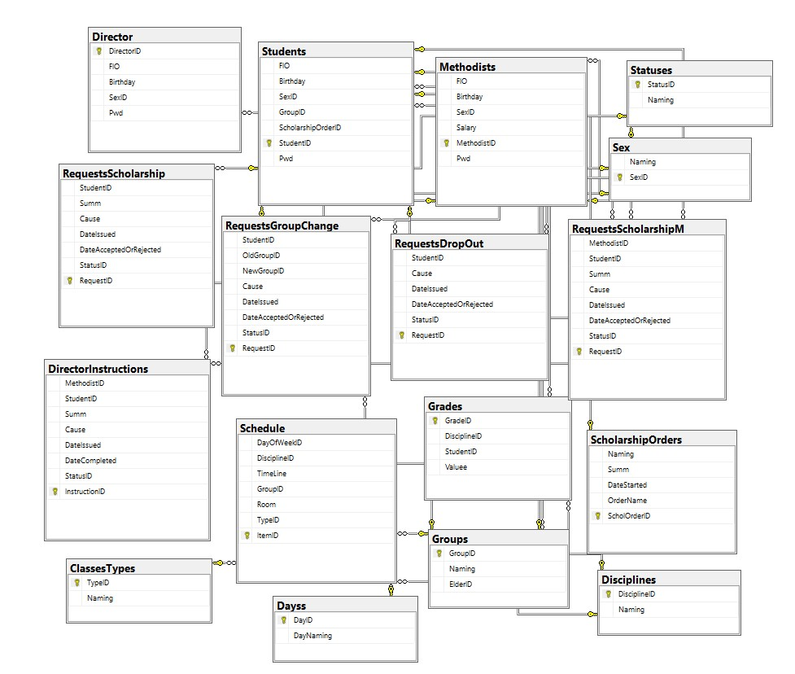
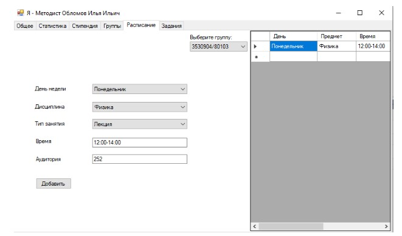

# Dean-Office-Automation
# Курсовой проект в СПбПУ Петра Великого по дисциплине "Базы Данных"
Технологический стек: MS SQL Server + Windows Forms | Visual C#.  
Скрипты создания БД и запросы - в папке SQL.  
Основные формы клиентского приложения:
* LoginForm.cs
* LoginForm2.cs
* DirectorForm.cs
* StudentForm.cs
* MethodistForm.cs  

# Схема базы данных:

# Один скриншот из приложения:

